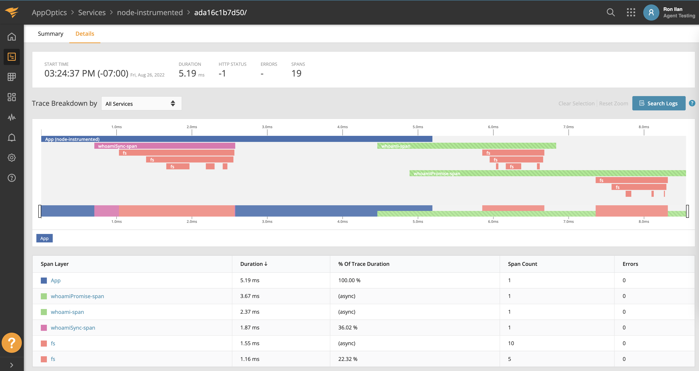
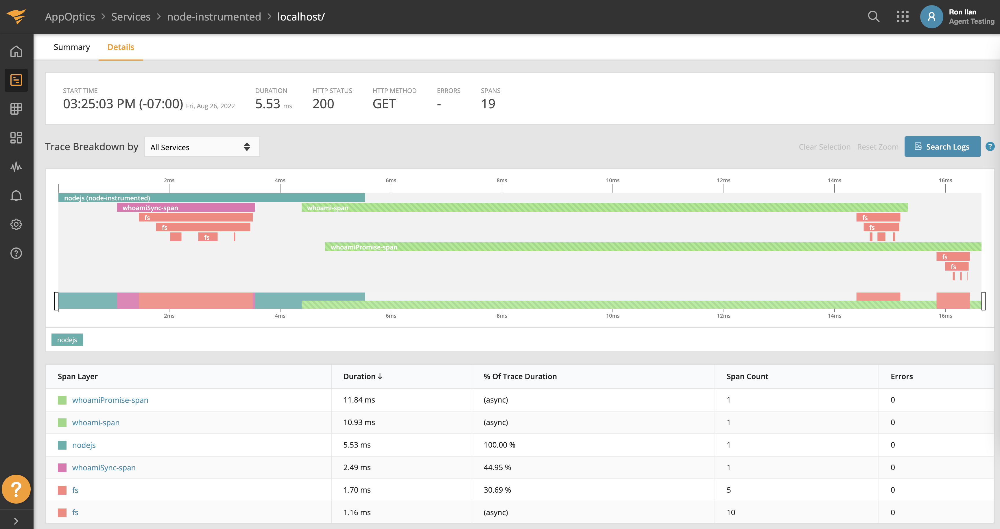

## What is this?

This is a demo of an app being instrumented using AppOptics/SolarWinds-APM custom instrumentation in a non-intrusive manner.

## Running the demo (AppOptics)

1. Build a container (AppOptics is Linux only): `docker build . -t appoptics-custom`
2. Run and open shell: `docker docker run -it --name appoptics --env APPOPTICS_SERVICE_KEY={valid_service_key} appoptics-custom sh`
3. to run the non-http trace demo `npm run appoptics:non` 
4. to run the http trace demo:
  - `npm run appoptics:server`
  - open another shell: `docker exec -it appoptics sh`
  - in the other shell: `curl -i localhost:3000/`
5. Cleanup: `docker container rm appoptics`

## What you get

### Non HTTP

### HTTP

